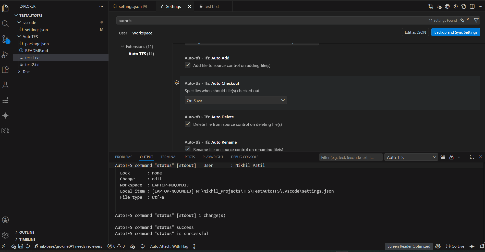
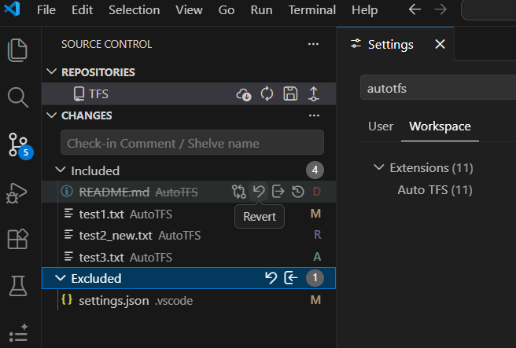
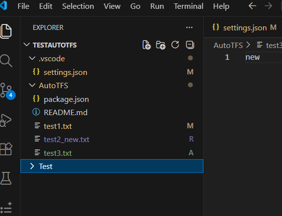
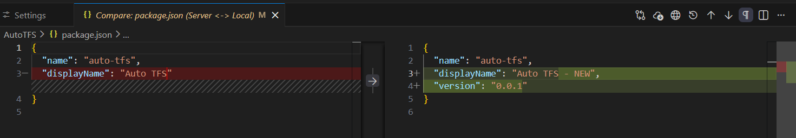
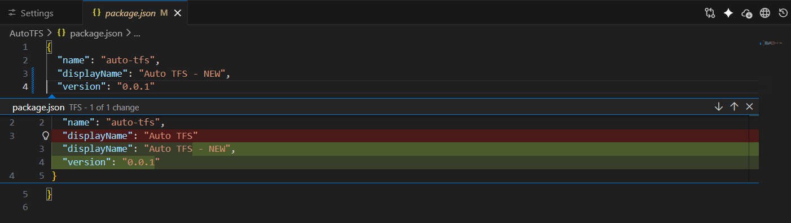

# TFS integration for Visual Studio Code

[](https://github.com/nik-base/auto-tfs/blob/master/LICENSE)
[](https://github.com/nik-base/auto-tfs/actions/workflows/ci.yml)
[](https://github.com/nik-base/auto-tfs/actions/workflows/codeql-analysis.yml)
[](https://github.com/nik-base/auto-tfs/issues)
[](https://dependabot.com/)
[](https://github.com/sponsors/nik-base)
[](https://ko-fi.com/nikhil2203)

Full TFS/TFVC source control integration for Visual Studio Code — with auto-checkout, SCM view, shelving, check-in, diff, and more.

---

## Screenshots



---









---

## Features

- Configurable automatic checkout, add, delete, and rename on source control
- Checkout, add, delete, rename via context menus in Explorer, Editor, and Editor Title
- Get latest of entire workspace or individual items from context menus, status bar, and SCM view
- Compare files with the latest server version in Visual Studio Code or Visual Studio
- In-file quick diff for checked-out files
- Check in files with or without a Visual Studio prompt
- Shelve and replace shelvesets
- Color-coded SCM view with badges showing workspace changes — same as Git
- Automatically or manually sync (refresh) workspace changes
- View all changes in the SCM view, with options to compare, revert, shelve, include, and exclude
- Open files on the server in a browser
- View item history via Visual Studio prompt
- TFS language support: **English and Spanish**

---

## Prerequisites

1. This extension requires access to the TF command-line tool provided by Microsoft. You need either:
   - **Visual Studio IDE** with TFS capabilities (i.e. `TF.exe` installed), or
   - **Team Explorer Everywhere** — [github.com/Microsoft/team-explorer-everywhere](https://github.com/Microsoft/team-explorer-everywhere)

   > **Note:** Other third-party tools may also work if they accept the same commands and produce compatible output.
   > **Note (Team Explorer Everywhere):** May work on Linux and macOS, but this has not been tested.

2. The extension requires a workspace already mapped in TFS (preferably as a Server workspace).

3. Minimum Visual Studio Code version: **1.95.0**

---

## Installation

1. Open VS Code
2. Press `F1`
3. Type `ext` and select **Extensions: Install Extension**
4. Search for `auto-tfs`
5. Select **Auto TFS** and press `Enter`

---

## Configuration

Set the full path to your TF tool in VS Code Settings (**File > Preferences > Settings**).

> Recommended: Configure in Workspace settings if AutoTFS is only used for specific workspaces, to avoid conflicts with Git workspaces.

```json
"auto-tfs.tf.path": "<path-to-tf-command-line>"
```

If your TFS installation uses a language other than English, set it here:

```json
"auto-tfs.tf.language": "<installed-tfs-language>"
```

> This is the language of TFS itself, not the extension UI. Currently supported: **English** and **Spanish**.

**Example paths:**

Visual Studio 2015 and earlier:

```
C:\Program Files (x86)\Microsoft Visual Studio 14.0\Common7\IDE\TF.exe
```

Visual Studio 2019 (Professional):

```
C:\Program Files (x86)\Microsoft Visual Studio\2019\Professional\Common7\IDE\CommonExtensions\Microsoft\TeamFoundation\Team Explorer\TF.exe
```

Team Explorer Everywhere:

```
C:\Program Files (x86)\TeamExplorerEverywhere\tf.cmd
```

---

## Authorization

If credentials are required, you will be prompted to enter them for the TFS account your workspace is mapped to. Otherwise, commands execute silently.

---

## Available Commands

| Command                  | Description                                    |
| ------------------------ | ---------------------------------------------- |
| Checkout                 | Check out a file for editing                   |
| Add                      | Add a new file to source control               |
| Undo                     | Undo pending changes                           |
| Delete                   | Delete a file from source control              |
| Get Latest               | Get the latest version of a file or folder     |
| Get All Latest           | Get the latest version of the entire workspace |
| Sync                     | Refresh change badges and SCM view             |
| Compare Here             | Diff against server version in VS Code         |
| Compare in Visual Studio | Diff against server version in Visual Studio   |
| View History             | Open item history in Visual Studio             |
| Open on Server           | Open the file on the TFS server in a browser   |

---

## Privacy & Security

AutoTFS is completely telemetry-free. No data, code, file contents, or usage information ever leaves your machine. It operates entirely locally using your existing TF tooling — no external servers, no analytics, no tracking of any kind. Safe for use in secure, regulated, and air-gapped environments.

---

## License

AutoTFS is licensed under the [MIT License](LICENSE) — free for personal, commercial, and open source use.

---

## Links

- [AutoTFS on GitHub](https://github.com/nik-base/auto-tfs)
- [MIT License](https://github.com/nik-base/auto-tfs/blob/master/LICENSE)

---

_Inspired by [niberius/z-tf-utils](https://github.com/niberius/z-tf-utils)_
